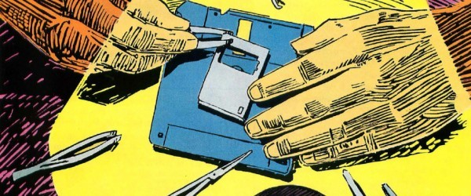
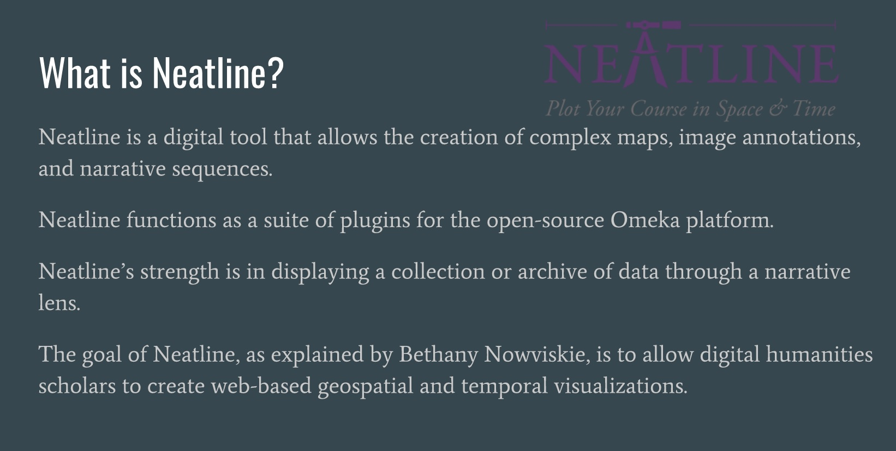
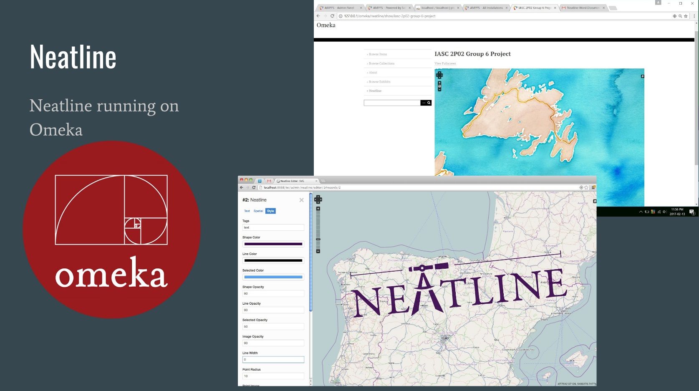

# IASC 2P02 | Thomas Burke

### Research Statement 

Greetings! My name is Thomas Burke and I am a second year Interactive Arts and Science student at Brock University. For means of this course, my research interest is in media archaeology. My research presentation reflects this interest, as it is the project I enjoyed working on the most. I found it interesting researching a now irrelevant piece of technology that clearly had great effect on the devices we have today. Through continuing work in media archaeology in the future, researching more about past media forms, and making connections to media forms of today, I would aim to predict trends in future media technology that could benefit myself, and others in the field.

### Featured Project

[Hello Car Phone!](reveal/index.html)

This goal of this project was to research an outdated piece of media, in this case, the car phone, and present my findings. In the project I try to go in chronological order through the development, changes, and eventual obsolescence of the car phone, as well as trying to explain its significance to the time period. I also describe how important the car phone was to the development of media devices today. The most interesting correlation I found was the connection between the development of a mobile phone, and the automobile. At the time, the car was the only platform able to meet the needs of a telephone that was not anchored to a home. I believe the significance of my research is that it shows that new media technology is not just inspired and built of the back of already existing media technology, but instead can be built off of other, seemingly unrelated systems and infrastructures, just like the car was a base for the development for the mobile telephone in my presentation

Going in to this project I did not know much about the car phone. I only knew that there used to be phones attached to cars. Unaware of the significance and impact the technology has had on today's media devices, I was pleasantly surprised when I began my research. My project reflected this as I continued my research. At first I had a focus on just what the car phone was, and the more I researched, and the more I developed my presentation, it became more about the ramifications the technology has had on today's devices. The car phone wasn’t just a singular piece of technology that existed, but rather a stepping stone, in a long line of technology innovations that’s goal is to make the lives of people easier. The car phone came because of a need to bring the telephone out of the home, which then pushed phone makers to develop a phone that could exist outside of a car. One of the pieces of feedback received on my presentation, was to focus a bit more on how the technology effected the forms of media we have today beyond just the obvious smart phone. This includes things like wireless technology, and Bluetooth devices. 

### Collaborative Project

.jpg)

For my collaborative project, I worked with my team members to explore the digital tool Neatline. Neatline is a tool that allows the creation of complex maps, image annotations, and narrative sequences. The challenges with Neatline is that it runs as a plugin for the Omeka platform, which requires knowledge in setting up data bases to configure correctly. Beyond that however, Neatline allows for powerful, and flexible data visualizations. Most of our time on the project was put into figuring out how to set up Neatline properly, as between our group members we did not have sufficient database knowledge to set it up without issues. After getting Neatline set up in a usable state, we looked at how we could apply the data from some of our course readings to Neatline.

My approach to collaborative work, is to be the team player. By this, I mean I try to pick up the parts of the project that my team members may not want to do. I would rather have my team members work on parts of the project  that they are strongest and most comfortable at, so they can produce the best work they can. This is something small I can do that can help produce a better final result, and is something I learned from playing team based competitive video games such as League of Legends and Overwatch. The second thing I try to do when working in a team is to take a leadership role, when none currently exists, or when the group begins to lose focus and stray away from the main goal of the project. This group oriented mindset is represented in my work in the group project. I picked up the 'grunt work' of the project. This involved doing research into the tool and the people and organizations behind it, as well as setting up the slideshow for our presentation. Through discussions about the project with my team members, there was a lot of great discussion about the possibilities and outcomes we could accomplish, however there were a couple times where I would have to step up to remind the group about the guidelines of the project, and to try get us to cover all the points of the project that was required. Other than group discussions, we shared all our work over google drive. This allowed any group member to see or contribute to the project whenever, from wherever, which helped a lot because of how difficult it can be to coordinate schedules between group members. 

### Research Presentation

[Hello Car Phone!](reveal/index.html)

### Academic Blog

[Context and Bias](blog)

